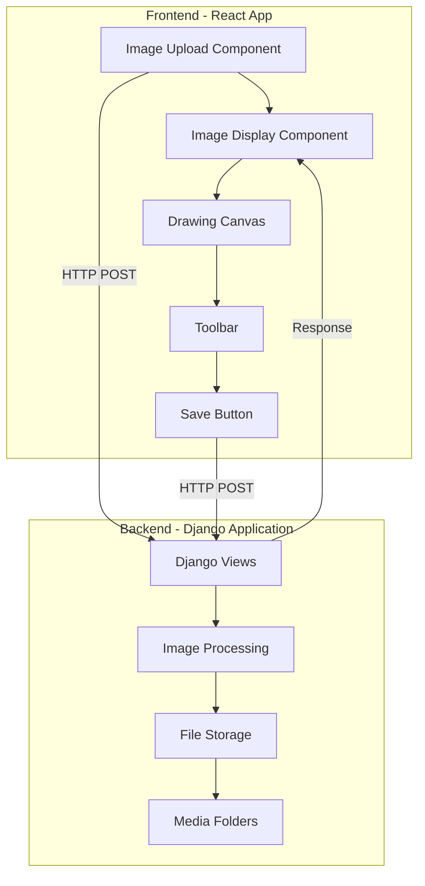
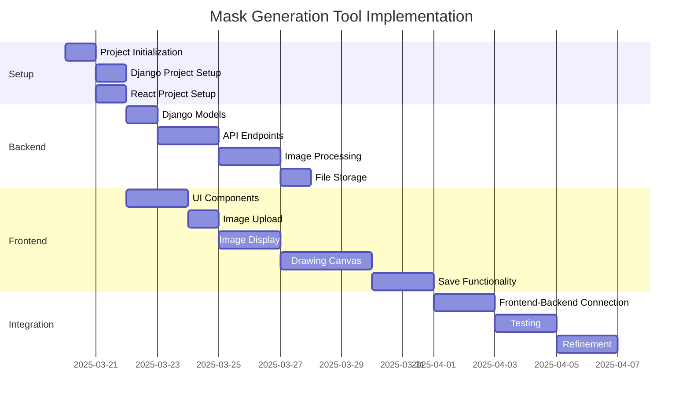
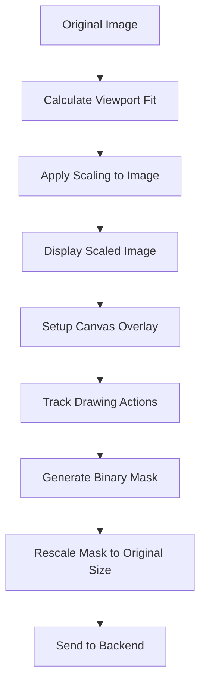
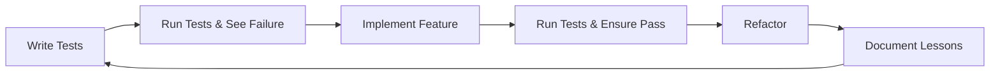

# Mask Generation Tool - Product Requirements Document

## 1. Project Overview

### 1.1 Vision
A local web application that allows users to upload images and manually create masks by drawing on those images. The application will handle proper scaling, provide drawing and erasing capabilities, and save both original images and generated masks in appropriate folders.

### 1.2 Goals
- Create an intuitive UI for image upload and mask creation
- Implement accurate scaling and transform logic
- Provide drawing and erasing functionality
- Ensure proper storage of images and masks
- Make the application educational for learning React and Django

## 2. User Stories

1. As a user, I want to upload a JPEG image so that I can create a mask for it.
2. As a user, I want the application to handle MPO files by converting them to JPEG.
3. As a user, I want to see my uploaded image properly scaled to fit my screen.
4. As a user, I want to draw on the image to mark areas for the mask.
5. As a user, I want to erase parts of my drawing if I make a mistake.
6. As a user, I want to save the mask and have it properly scaled to match the original image dimensions.

## 3. Technical Architecture



### 3.1 Frontend Architecture (React)

I'll use **Vite** as the build tool for the React application as it's become the industry standard due to its speed and modern defaults. For state management, we'll use React's **Context API** with hooks since it's built-in and sufficient for our needs. For UI styling, we'll use **Chakra UI** as it provides accessible components with a clean design that's easy to customize.

Key components:
1. **App Container**: Main layout and routing
2. **ImageUploader**: Handles file selection and uploading
3. **ImageEditor**: Displays image and manages drawing functionality
4. **DrawingCanvas**: Overlay for drawing on the image
5. **ToolBar**: Contains drawing, erasing, and save controls
6. **SaveButton**: Processes the drawing and sends to backend

### 3.2 Backend Architecture (Django)

Django follows the MVT (Model-View-Template) architecture:

- **Models**: Define data structures for storing image information
- **Views**: Handle HTTP requests and responses 
- **Templates**: Not heavily used as we'll have a React frontend, but may be used for serving the initial HTML

Django concepts we'll use:
1. **Django REST Framework**: For creating API endpoints for the React frontend
2. **Django Models**: For database representation of our images and masks
3. **Media File Handling**: For storing and serving uploaded images and masks
4. **Django Settings**: For configuring paths and permissions

## 4. Detailed Requirements

### 4.1 Frontend Requirements

1. **Image Upload Component**
   - Accept JPEG files
   - Detect and handle MPO files
   - Show upload progress
   - Display validation errors

2. **Image Display**
   - Calculate scaling to fit viewport while maintaining aspect ratio
   - Store original dimensions and scale factor
   - Apply smooth scaling

3. **Drawing Canvas**
   - Implement transparent overlay with darkened drawing
   - Track mouse/touch movements
   - Support different brush sizes

4. **Toolbar**
   - Provide draw tool
   - Provide erase tool
   - Include undo functionality
   - Include clear all option

5. **Save Functionality**
   - Convert drawing to binary mask (white marks on black background)
   - Rescale mask to original image dimensions
   - Send to backend for saving
   - Show success confirmation

### 4.2 Backend Requirements

1. **API Endpoints**
   - POST `/api/images/upload` - Handle image uploads
   - POST `/api/masks/save` - Save generated masks
   - GET `/api/images/:id` - Retrieve uploaded images

2. **Image Processing**
   - Convert MPO to JPEG if needed
   - Store original image metadata
   - Handle image scaling

3. **File Storage**
   - Create `/images` folder for original uploads
   - Create `/masks` folder for generated masks
   - Use consistent naming convention for pairs
   - Handle filesystem operations safely

4. **Error Handling**
   - Provide meaningful error messages
   - Handle invalid file types
   - Manage disk space issues

## 5. Implementation Plan



### 5.1 Technology Stack

**Frontend:**
- React (via Vite)
- Context API for state management
- Chakra UI for components
- Axios for API requests
- Canvas API for drawing functionality

**Backend:**
- Django 5.0+
- Django REST Framework
- Pillow for image processing
- Python 3.11+

### 5.2 Django Project Structure

```
backend/
├── manage.py
├── mask_generator/
│   ├── __init__.py
│   ├── asgi.py
│   ├── settings.py
│   ├── urls.py
│   └── wsgi.py
├── api/
│   ├── __init__.py
│   ├── admin.py
│   ├── apps.py
│   ├── models.py
│   ├── serializers.py
│   ├── urls.py
│   └── views.py
└── media/
    ├── images/
    └── masks/
```

### 5.3 React Project Structure

```
frontend/
├── index.html
├── package.json
├── vite.config.js
└── src/
    ├── main.jsx
    ├── App.jsx
    ├── components/
    │   ├── ImageUploader.jsx
    │   ├── ImageEditor.jsx
    │   ├── DrawingCanvas.jsx
    │   └── Toolbar.jsx
    ├── contexts/
    │   └── ImageContext.jsx
    ├── services/
    │   └── api.js
    └── utils/
        └── imageProcessing.js
```

## 6. Technical Implementation Details

### 6.1 Image Scaling and Drawing

The core technical challenge involves properly handling image scaling and drawing operations:



1. **Viewport Fit Algorithm**:
   - Calculate scale factor based on viewport size vs. image dimensions
   - Store original dimensions and scale factor
   - Apply CSS transformations for display

2. **Drawing Implementation**:
   - Use HTML Canvas positioned absolutely over image
   - Capture mouse/touch events
   - Map event coordinates to canvas coordinates
   - Apply drawing with semi-transparent color

3. **Mask Generation**:
   - Convert drawing to binary format (black/white)
   - Use canvas `toDataURL()` to get image data
   - Apply inverse transform to rescale to original dimensions
   - Convert to appropriate format for backend

### 6.2 Django Image Processing

Django will handle image storage and processing using the following approach:

1. **Image Upload**:
   - Use Django REST Framework for handling multipart form data
   - Process with Pillow to check format and handle MPO conversion
   - Store metadata in Django model
   - Save to filesystem with generated filename

2. **MPO Handling**:
   - Detect MPO format using Pillow or file signatures
   - Extract first layer and convert to JPEG
   - Store conversion information in metadata

3. **Mask Storage**:
   - Receive mask data from frontend
   - Process to ensure proper formatting
   - Save with matching filename to corresponding image
   - Update database record to link image and mask

## 7. Test-Driven Development Approach

We'll implement this project following Test-Driven Development (TDD) principles, where tests are written before implementing the actual functionality. This methodology will help ensure code quality, improve design, and provide regression testing as we develop.

### 7.1 TDD Workflow

Our TDD workflow will follow these steps for each feature:

1. **Write Tests First**: Create tests that define the expected behavior before writing any implementation code
2. **Run Tests and Watch Them Fail**: Confirm that the tests fail as expected (since implementation doesn't exist yet)
3. **Implement the Feature**: Write the minimum code necessary to make the tests pass
4. **Run Tests and Ensure They Pass**: Verify that the implementation meets the requirements defined by the tests
5. **Refactor**: Clean up the code while keeping tests passing
6. **Document**: Update lessons_learned.md with insights gained from the implementation



### 7.2 Backend Testing (Django)

For the Django backend, we'll use:

1. **Django Test Framework**: Built-in testing framework that extends Python's unittest
2. **pytest**: For more powerful test fixtures and assertions
3. **django-rest-framework testing tools**: For API endpoint testing

Test structure:
```
backend/
├── api/
│   ├── tests/
│   │   ├── __init__.py
│   │   ├── test_models.py
│   │   ├── test_views.py
│   │   ├── test_serializers.py
│   │   └── test_image_processing.py
```

Test categories:

1. **Unit Tests**:
   - Model validation and methods
   - Serializer validation and conversion
   - Image processing functions
   - Utility functions

2. **Integration Tests**:
   - API endpoints
   - File storage workflow
   - End-to-end image upload to mask generation

3. **Mocking**:
   - File system operations
   - External libraries (Pillow)
   - Request/response cycles

### 7.3 Frontend Testing (React)

For the React frontend, we'll use:

1. **Jest**: JavaScript testing framework
2. **React Testing Library**: For testing React components
3. **Mock Service Worker**: For mocking API requests
4. **Cypress**: For end-to-end testing of critical user flows

Test structure:
```
frontend/
├── src/
│   ├── __tests__/
│   │   ├── components/
│   │   │   ├── ImageUploader.test.jsx
│   │   │   ├── ImageEditor.test.jsx
│   │   │   ├── DrawingCanvas.test.jsx
│   │   │   └── Toolbar.test.jsx
│   │   ├── contexts/
│   │   │   └── ImageContext.test.jsx
│   │   ├── utils/
│   │   │   └── imageProcessing.test.js
│   ├── cypress/
│   │   ├── e2e/
│   │   │   ├── upload.cy.js
│   │   │   ├── drawing.cy.js
│   │   │   └── saving.cy.js
```

Test categories:

1. **Unit Tests**:
   - Component rendering
   - Hook logic
   - Utility functions
   - State management

2. **Integration Tests**:
   - Component interactions
   - Context providers
   - User interactions

3. **End-to-End Tests**:
   - Complete workflows (upload → draw → save)
   - Error handling
   - Edge cases (large images, browser compatibility)

### 7.4 Test Automation and CI/CD

Test automation will be set up from the beginning:

1. **Pre-commit hooks**: Run tests before git commits
2. **Test runners**: Configure for both Django and React projects
3. **Test coverage**: Track and maintain high test coverage

## 8. Learning Components

As requested, I've built in learning opportunities for both React and Django:

### 8.1 React Learning

1. **Modern React Patterns**:
   - Functional components with hooks
   - Context API for state management
   - Custom hooks for reusable logic

2. **Canvas Manipulation**:
   - Direct Canvas API usage
   - Coordinate transformations
   - Drawing state management

3. **Responsive Design**:
   - Viewport considerations
   - Dynamic scaling
   - Touch and mouse event handling

### 8.2 Django Learning

1. **Django REST Framework**:
   - API endpoints and serializers
   - Request validation
   - Response formatting

2. **Media File Handling**:
   - Django's media system
   - File storage abstractions
   - URL routing for media files

3. **Image Processing with Pillow**:
   - Format detection and conversion
   - Metadata extraction
   - Image transformation

## 9. Local Development Setup

### 9.1 Backend Setup

```bash
# Create virtual environment
python -m venv venv
source venv/bin/activate  # On Windows: venv\Scripts\activate

# Install Django and dependencies
pip install django djangorestframework pillow

# Start Django project
django-admin startproject mask_generator
cd mask_generator
python manage.py startapp api

# Setup database
python manage.py makemigrations
python manage.py migrate

# Run development server
python manage.py runserver
```

### 9.2 Frontend Setup

```bash
# Create Vite project with React
npm create vite@latest frontend -- --template react
cd frontend
npm install

# Install dependencies
npm install axios @chakra-ui/react @emotion/react @emotion/styled framer-motion

# Run development server
npm run dev
```

## 10. Lessons Learned Documentation

We'll maintain a structured `lessons_learned.md` file that will be updated after implementing each major concept. This document will serve as a knowledge repository and learning journal throughout the project.

### 10.1 Document Structure

The lessons_learned.md file will be organized into the following sections:

```markdown
# Mask Generator Tool - Lessons Learned

## React Concepts
- [Concept Name]
  - What it is
  - How we used it
  - Key takeaways
  - Additional resources

## Django Concepts
- [Concept Name]
  - What it is
  - How we used it
  - Key takeaways
  - Additional resources

## Image Processing
- [Technique Name]
  - How it works
  - Implementation details
  - Performance considerations

## General Development Practices
- [Practice Name]
  - Benefits
  - Implementation examples
  - Best practices
```

### 10.2 Update Process

After completing each major component or implementing a new concept, we'll:

1. Document the concept in the appropriate section
2. Explain how it was implemented in our project
3. Note any challenges encountered and solutions found
4. Include useful code snippets or patterns
5. Link to additional learning resources

This documentation will create a valuable resource for future reference and ensure the educational value of the project is maximized.

## 11. Next Steps

After reviewing this plan, you may want to:

1. Review and provide feedback on the architecture and requirements
2. Adjust any specific technical implementation details
3. Begin implementation using a step-by-step approach
4. Set up the initial project structure and lessons_learned.md file