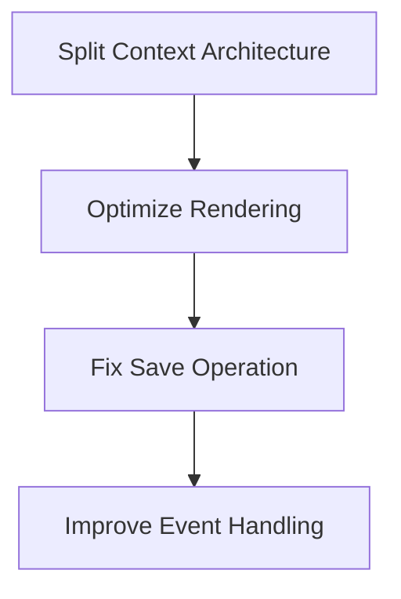
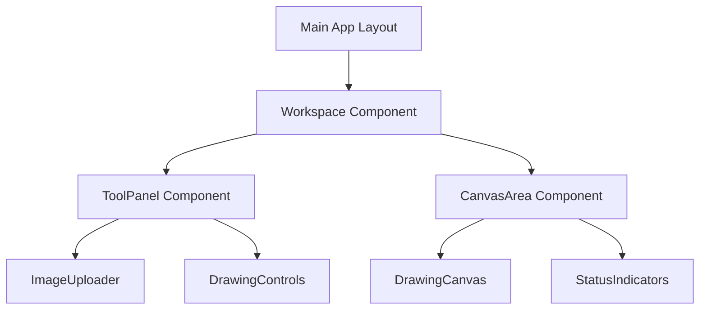
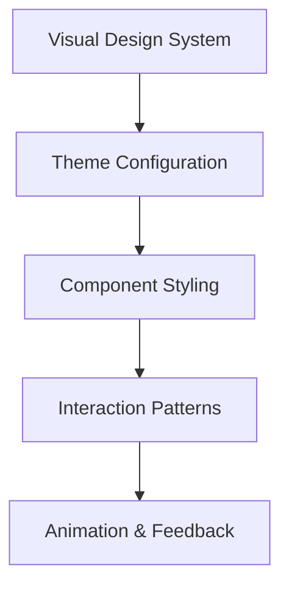

# Professional UI Design Plan for Mask Generator Tool

This document outlines a comprehensive plan to enhance the Mask Generator Tool with a professional UI while optimizing performance.

## Overview

The current Mask Generator Tool provides essential functionality for creating binary masks for images. This plan focuses on:

1. Addressing state management issues that cause re-rendering problems
2. Creating a more professional and efficient UI layout
3. Applying a clean, light-themed design system for visual polish

## Implementation Phases

### Phase 1: State Management Refactoring (Foundation)

#### Key Improvements:

- **Restructured Context Architecture**
  - Split monolithic context into specialized contexts (UI, Canvas, App)
  - Implement memoization to prevent unnecessary re-renders
  - Create optimized hooks for common operations

- **Optimized Save Operation**
  - Use a temporary canvas for saving to prevent affecting the display
  - Implement non-blocking save operation with proper status indicators
  - Fix the image re-rendering issue when saving masks

- **Performance Optimizations**
  - Use `useCallback` and `useMemo` for performance-critical functions
  - Implement ref-based state for high-frequency updates
  - Add debouncing for UI controls like brush size

### Phase 2: UI Layout Restructuring (Structure)

#### Key Improvements:

- **Professional Layout Structure**
  - Organize the application into logical sections
  - Create a dedicated tool panel for all controls
  - Maximize canvas workspace area
  - Add status indicators for operations

- **Component Organization**
  - Group related controls together
  - Show/hide contextual controls based on application state
  - Implement a consistent component hierarchy

- **Responsive Considerations**
  - Create a layout that adapts to different screen sizes
  - Prioritize canvas workspace on smaller screens

### Phase 3: Visual Design System (Polish)

#### Key Improvements:

- **Light Theme Design System**
  - Clean, professional color palette
  - Consistent spacing and typography
  - Clear visual hierarchy

- **Enhanced UI Components**
  - Professional button styling with icons
  - Improved input controls
  - Visual indicators for active tools
  - Brush size preview

- **Interactive Elements**
  - Clear hover/active states
  - Visual feedback for actions
  - Improved tooltips and help text

## Technical Implementation

### State Management Structure

The new state management architecture separates concerns into three contexts:

1. **UI Context** - Manages interface state like loading, errors, and tool settings
2. **Canvas Context** - Handles drawing-related state like strokes and operations
3. **App Context** - Maintains application-level state like image data and dimensions

This separation allows for more targeted rendering optimizations and clearer code organization.

### Optimized Rendering Strategy

- Use React's memoization capabilities to prevent unnecessary re-renders
- Leverage refs for high-frequency updates that don't need to trigger renders
- Batch updates for related state changes
- Implement pure components with proper dependency arrays

### Save Operation Improvements

The save operation will be refactored to:
- Create a separate copy of the canvas for export
- Prevent blocking the UI during save
- Provide clear status indicators
- Maintain canvas state during and after saving

## Visual Design Direction

### Color Palette

- **Background**: Clean whites (#ffffff, #f8f9fa)
- **Accents**: Blues for interactive elements (#3182ce, #4299e1)
- **Text**: Dark grays for readability (#1a202c, #4a5568)
- **Status**: Green for success, red for errors, orange for warnings

### Component Design

- **Buttons**: Clear, consistent styling with icon+text for important actions
- **Tools**: Visual indicators for active state
- **Panels**: Clean white backgrounds with subtle shadows
- **Canvas**: Neutral background with optional grid

### User Experience Enhancements

- Improved visual feedback for all interactions
- Clear indication of current tool and settings
- Streamlined workflows requiring fewer clicks
- Professional styling consistent throughout the application

## Implementation Workflow

1. Start with core state management refactoring
2. Update component architecture while maintaining functionality
3. Apply visual design system
4. Test and refine interactions
5. Optimize performance

This approach ensures a solid foundation before applying visual polish, making the codebase more maintainable while enhancing the user experience.